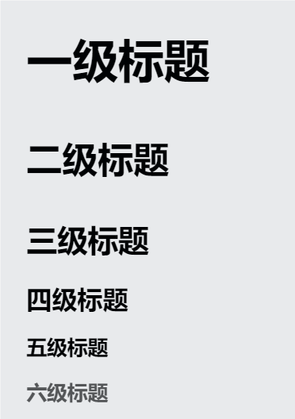

# 系统复习markdown基础语法

## 1.分级标题
```md
# 一级标题
## 二级标题
### 三级标题
#### 四级标题
##### 五级标题
###### 六级标题
```


## 2.段落
直接回车即为分段
```md
这是第一段
这是第二段

这是换行
```
这是第一段
这是第二段

这是换行

## 3.换行符
如果你需要换>=2行，那么只用回车是不可以的，我们需要用到 `<br>`
```md
我是第一段
<br>
<br>
<br>
嘻嘻，我换了三行
```
我是第一段
<br>
<br>
<br>
嘻嘻，我换了三行

## 4.强调与斜体
### 4.1 强调
```md
我是 **重点**
我是 __重点__
```
我是**重点**，由四个*构成，我无所谓有无空格标点，但是我和*之间不可以包含标点

我是 __重点__,由四个_构成，我必须和非强调内容空一格，或者有标点符号隔开我们，不过我内部任意位置可以包裹标点

### 4.2 斜体
```md
我是*斜体*
我是 _斜体_
```
我是*斜体*，我和星号老哥一个德行
我是 _斜体_，我和强调老哥一个德行

## 5.删除，下划线

### 5.1 删除

```md
~~沃德玛，沃肿么帅德布耀布耀德~~
<del>为什么我的删除线变浅了，我可真聪明</del>
```
~~沃德玛，沃肿么帅德布耀布耀德~~

<del> 为什么我的删除线变浅了，我可真聪明</del>

### 5.2 下划线
```md
<u>嘻嘻嘻嘻嘻嘻嘻，看看我，我是下划线</u>
```
<u>嘻嘻嘻嘻嘻嘻嘻，看看我，我是下划线</u>


## 6.外链接，为链接添加标题，URL和电子邮件地址转化为链接，格式化链接

### 6.1 外链接
```md
[全世界最好看的博客之一](https://home.cnblogs.com/u/GJ504b)
```
[全世界最好看的博客之一](https://home.cnblogs.com/u/GJ504b)

### 6.2 为链接添加标题
```md
[全世界最好看的博客之一](https://home.cnblogs.com/u/GJ504b "作者真有才华")

<!-- 记得要空一格，是英文""  -->
```
[全世界最好看的博客之一](https://home.cnblogs.com/u/GJ504b  "作者真有才华")

### 6.3 URL和电子地址转化为链接
```md
<123456789@qq.com>
<https://home.cnblogs.com/u/GJ504b>
```
<123456789@qq.com>
<https://home.cnblogs.com/u/GJ504b>

### 6.4 格式化链接
强调，斜体，删除，下划线，直接加在整个部分外就好了
如果要把超链接转成代码，需要加上``
```md
**[全世界最好看的博客之一](https://home.cnblogs.com/u/GJ504b  "作者真有才华")**

*[全世界最好看的博客之一](https://home.cnblogs.com/u/GJ504b  "作者真有才华")*

<u>[全世界最好看的博客之一](https://home.cnblogs.com/u/GJ504b  "作者真有才华")</u>

~~[全世界最好看的博客之一](https://home.cnblogs.com/u/GJ504b  "作者真有才华")~~

[`console.log("我喜欢这篇笔记")`](https://home.cnblogs.com/u/GJ504b  "作者真有才华")
```
**[全世界最好看的博客之一](https://home.cnblogs.com/u/GJ504b  "作者真有才华")**

*[全世界最好看的博客之一](https://home.cnblogs.com/u/GJ504b  "作者真有才华")*

<u>[全世界最好看的博客之一](https://home.cnblogs.com/u/GJ504b  "作者真有才华")</u>

~~[全世界最好看的博客之一](https://home.cnblogs.com/u/GJ504b  "作者真有才华")~~

[`console.log("我喜欢这篇笔记")`](https://home.cnblogs.com/u/GJ504b  "作者真有才华")


## 7.插入图像，给图像添加链接
### 7.1 插入图像
```md


```


### 7.2 给图片添加链接
图片部分用中括号包裹，后面加括号，写链接
```md
[](https://home.cnblogs.com/u/GJ504b  "作者真有才华")
```
[](https://home.cnblogs.com/u/GJ504b  "作者真有才华")

## 8. 引用块，多个段落引用块，嵌套引用块，带有其他元素的引用块
### 8.1 引用块
在开头加上`>`
```md
>前途是光明的，道路是曲折的。

```
>前途是光明的，道路是曲折的。

### 8.2 多个段落引用块
引用块可以换一行，在段落之间的空白行上添加一个 `>`
```md
> I love once.
> 
> I love twice.
>
> I love more than beans and rice.
```
> I love once.
> 
> I love twice.
>
> I love more than beans and rice.

### 8.3 嵌套引用块
```md
>《三体》语录：
>
>>失去人性，失去很多，失去兽性，失去一切。
>>
>>你的无畏源于你的无知
>>
>>我们都是虫子
```

>《三体》语录：
>
>>失去人性，失去很多，失去兽性，失去一切。
>>
>>你的无畏源于你的无知
>>
>>我们都是虫子

### 8.4 带有其他元素的引用
```md
>怎么能不**遗憾**呢
> + 爱就爱了
> + 不怕没来过
> + 恨就恨了
> + 我从没想过
> *I'll always waiting here for u!*
```
>怎么能不**遗憾**呢
> + 爱就爱了
> + 不怕没来过
> + 恨就恨了
> + 我从没想过
> *I'll always waiting here for u!*

## 9.无序列表，有序列表，列表嵌套
### 9.1 无序列表
```md
- Hellow
- Nice to meet u
- See u
```
- Hellow
- Nice to meet u
- See u
### 9.2 有序列表
```md
把大象装进冰箱需要几步？？
1. 打开冰箱门
2. 把大象塞进去
3. 关上冰箱门
```
把大象装进冰箱需要几步？？
1. 打开冰箱门
2. 把大象塞进去
3. 关上冰箱门

### 9.3 列表嵌套
```md
1. 第一
2. 第二
    1. 第1
    2. 第2
    3. 第3
        + 并列小点1
        + 并列小点2
        + 并列小点3
3. 第三
```
1. 第一
2. 第二
    1. 第1
    2. 第2
    3. 第3
        + 并列小点1
        + 并列小点2
        + 并列小点3
3. 第三

## 10.分割线
```md
都是英语输入法下的，三个及以上`*`
***

都是英语输入法下的，三个及以上`_`
___

都是英语输入法下的，三个及以上`- `有空格
- - -
```
都是英语输入法下的，三个及以上`*`
***

都是英语输入法下的，三个及以上`_`
___

都是英语输入法下的，三个及以上`- `有空格
- - -

## 11. 行内代码块，块级代码块
### 11.1 行内代码块
```md
`printf` `###` `int`
```
`printf` `###` `int`

### 11.1 块级代码块
```编程语言类型
代码片段
```

```js
console.log("Hello, world!");
```
